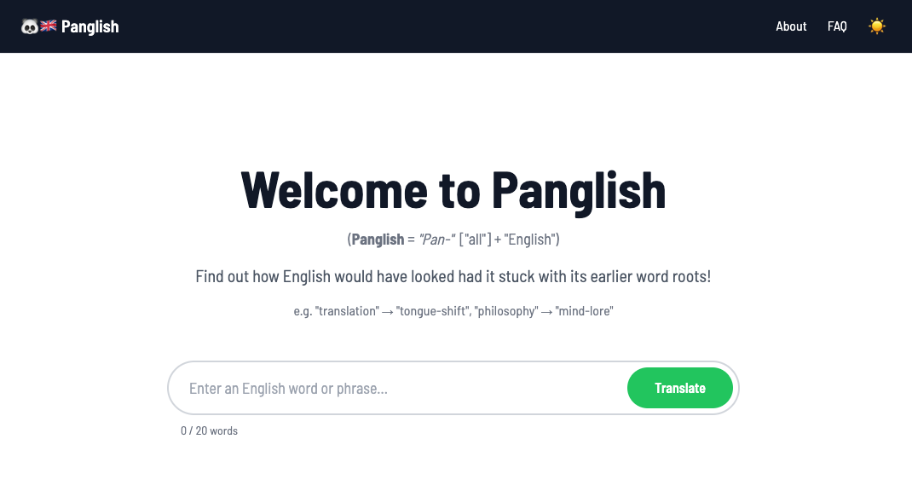
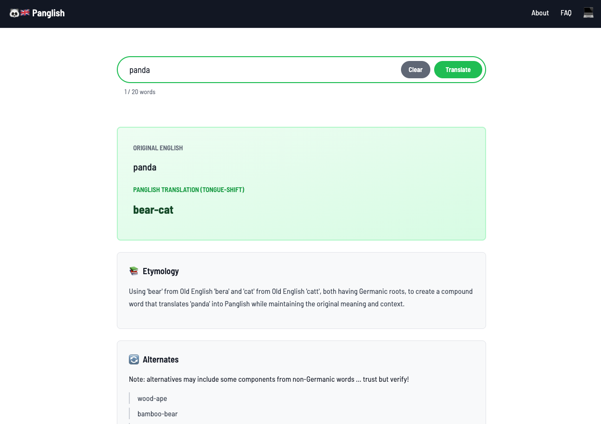
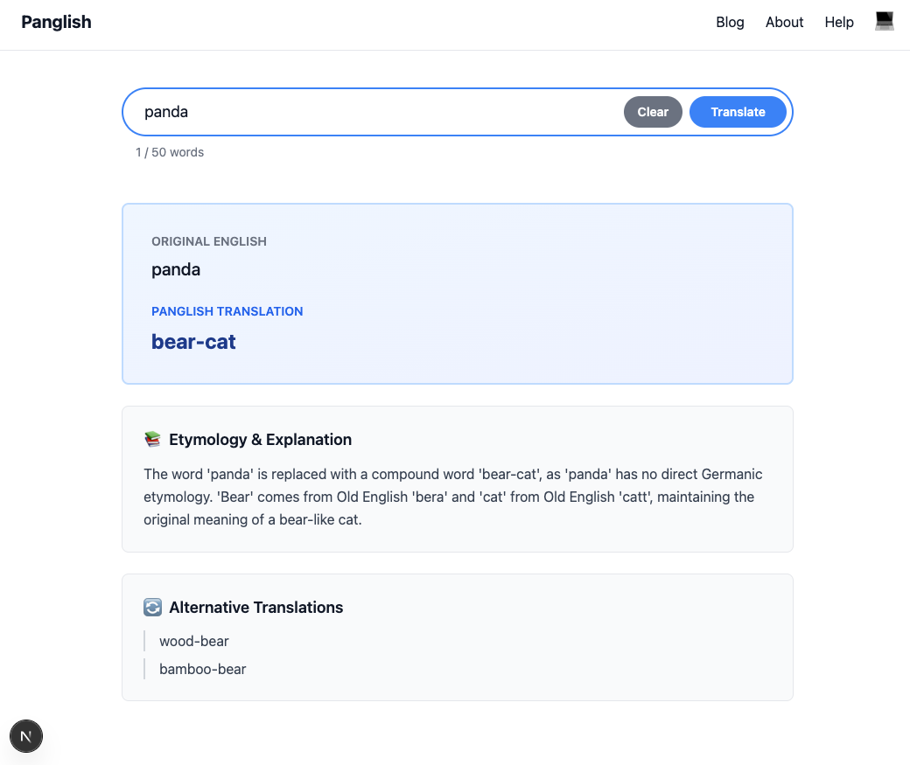

# Panglish

an LLM-powered dictionary/translation website using a specialized prompt template



Panglish is a linguistic experiment that translates modern English words and phrases back to their Germanic etymological roots (not to be confused with the current _German language_). By stripping away Latin, French, Greek (and most other) borrowings, we reveal the "pure" Germanic core of the English language.

English is a Germanic language that has borrowed heavily from Romance and other languages. Panglish imagines: what if English had developed without these influences?

The last two paragraphs would have looked like this:

> Panglish is a <strong>speechlore try-out</strong> that <strong>tongue-shifts</strong> <strong>same-timely</strong> English words and <strong>word-rows</strong> back to their Germanic <strong>word-birth</strong> roots (not to be <strong>mixed-up</strong> with <strong>today's</strong> <em>German</em> <strong>language</strong>). By stripping away Latin, French and Greek borrowings, we <strong>show</strong> the <strong>"rooted"</strong> Germanic <strong>heart</strong> of the English <strong>tongue</strong>. <br />
English is a Germanic <strong>tongue</strong> that has borrowed <strong>strongly</strong> from "Romance" and other <strong>tongues</strong>. Panglish <strong>thinks</strong>: what if English had <strong>grown</strong> without these <strong>borrowings?</strong>



## Features

* search bar to translate English to Panglish (20 word limit)
* translation results screen with:
  * possible translation (powered by AI)
  * etymology (word origin genealogy)
  * alternative translations
* about page
* dark mode (for those kind of days and nights!)

## Specifications

* front-end frameworks: `next.js` and `tailwind`
* large language model: `llama-3.3-70b-versatile`

## Demo

Run the demo on [panglish.joncoded.com](https://panglish.joncoded.com) or [panglish.vercel.app](https://panglish.vercel.app) if I forget to pay the bills


## Setup (for developers)

### clone repo

Run the following commands on your command line:

```bash
% git clone https://github.com/joncoded/panglish.git panglish && cd panglish
% npm install
```

### .env file

Configure your `.env.local` file on the root folder (this must be done):

```
GROQ_API_KEY=your_groq_api_key
```

If you don't have this you can get it for free at:

* [groq](https://console.groq.com/keys)
  * `GROQ_API_KEY` : create API key > copy and past an API key
    * you can later use the same API key for any LLM

### runtime!

Finally, back in the command line, run the app on your localhost with:

```
npm run dev
```

The app will run on `http://localhost:3000`

(if port 3000 is already used, it will host the app on `:3001` or on the next available port)

## Contribute

### Features

Make changes by following this procedure:

* clone the repository as mentioned above
* create a feature branch
  * `git checkout -b feature/branch`
* make and commit your changes
  * `git commit -m "what you changed"`
* push your changes
  * `git push origin feature/branch`
* open pull request
  * https://github.com/joncoded/panglish/pulls

Also, feel free to [raise any issues](https://github.com/joncoded/esleasel/issues)!

## Credits

* [Groq](https://groq.com/) for LLMs
* [Claude (Sonnet)](https://claude.ai) for helping me create this in one day (it's the idea behind the website, not the website itself, that I was trying to bring to life!)

## Heritage

What Panglish looked like when it was a "kid":



It had high hopes: had dreams of becoming a "blogger", but focused on being a translator, while changing its hair colour from blue to green!